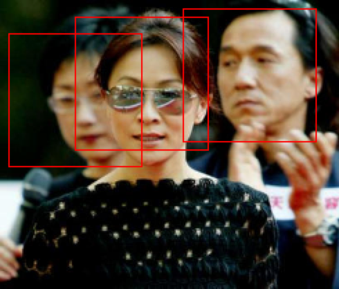

# TinyLearn
CS385 Project1, instructed by Prof. Quanshi Zhang and Dr. Xu Cheng, implementing Logistic Regression, SVM, fisher model and CNN by numpy. Also includes some visualization techniques such as PCA & t-SNE and detection part. 

Dataset can be download from [FDDB](http://vis-www.cs.umass.edu/fddb/). Please put the dataset in the TinyLearn folder and run the following command.

```python
python3 dataGeneration.py
```

and you will get your data in the data folder. Models are stored in models folder, and for every model there are a main_xxx.py. To verify the model's accuracy, just run the corresponding main.py is OK. For instance, if you want to see the result of CNN, just run

```python
python3 main_cnn.py
```

t-SNE and PCA are used to visualize the HoG features of the data. If you want to see the visualize result in tensorboard, please run the tensorboard_gen.py. All the implementing details are described in the report. To run detection result please run main_detection.py.

Also I add Cpp part of Machine Learning Algorithm implementation in it with a CMakeLists.txt. You can make it and run main.cpp to get the Cpp version result. Eigen should be placed in the directory written in CMakeLists.txt. Cpp version convolutional neural network will be added soon.

